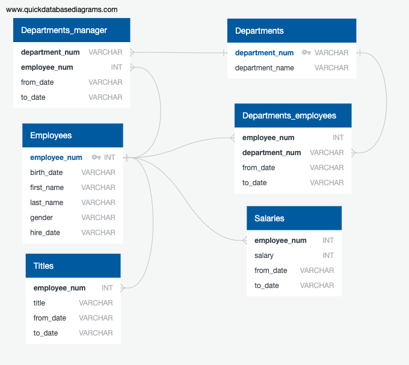
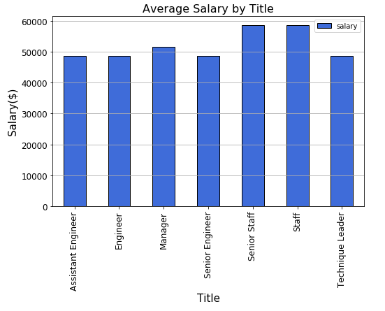
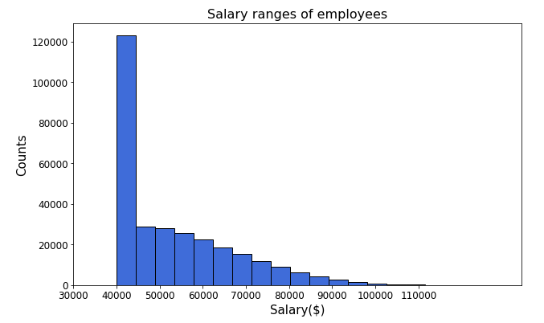

# Employee Database Analysis

The project consist on three parts:
* Data Modeling - Inspect the CSVs and sketch out an ERD of the tables
* Data Engineering - Create a table schema for each of the six CSV files
* Data analysis - Answer questions about the data

## Features

* Data modeling, engineering and analysis
* Use of sqlalchemy for the connection to the database

## Built with 

* PostgreSQL
* Python

## Outcomes

Here you can check some outcomes of the project. However, all the results anre contained in the files; feel free to check them out

Entity Relationship Diagram 

Bar chart of average salary by title

Histogram fo salary ranges from employees

